# DSX Local Workshop - User built Python packages + Custom Images on Hadoop

In this workshop, we'll cover:
- Developing custom python packages in DSX
- Testing custom python packages via spark addPyFile
- Installing custom packages into a DSX Runtime Image
- Making a Custom DSX Runtime (Python Virtual Environment) Available for Interactive Livy Notebooks


This lab is meant to be instructor-led. That is, the instructor will explain the objectives of the DSX capabilities covered in each lab, and demonstrate some of those capabilities at the beginning of each lab.
## Lab 1. Adding/Importing user py files in Remote Spark Notebooks

### Part 1 - Creating and using py functions in remote sessions.

**1. Create a new Python 2.7 Notebook**

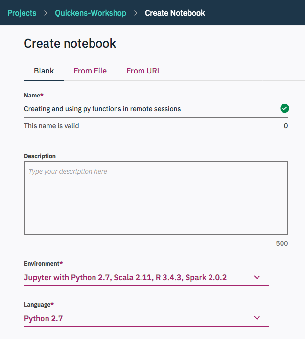

**2. Create a Remote Livy Session**

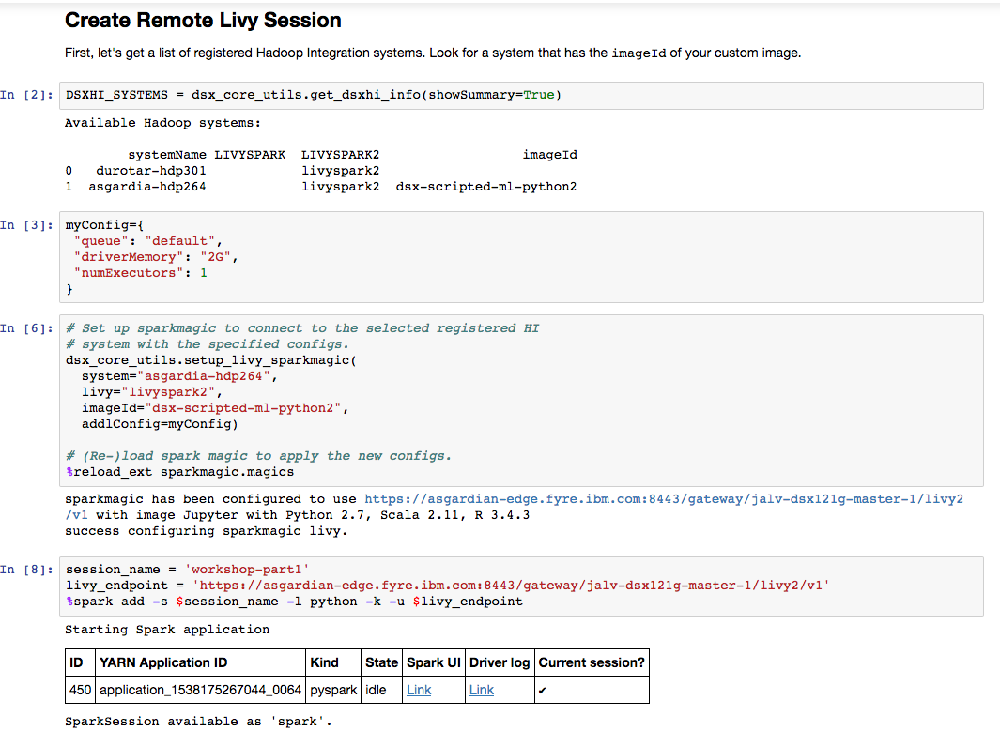

**3. Create and use custom functions remotely**

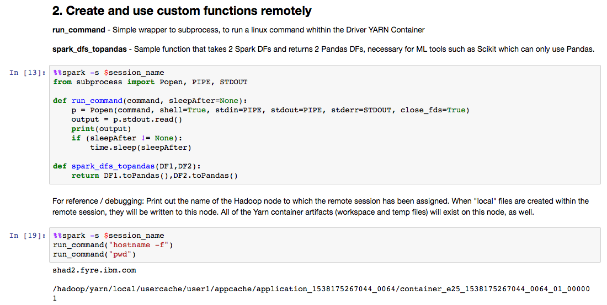

**4. Save functions as .py file in the Project**

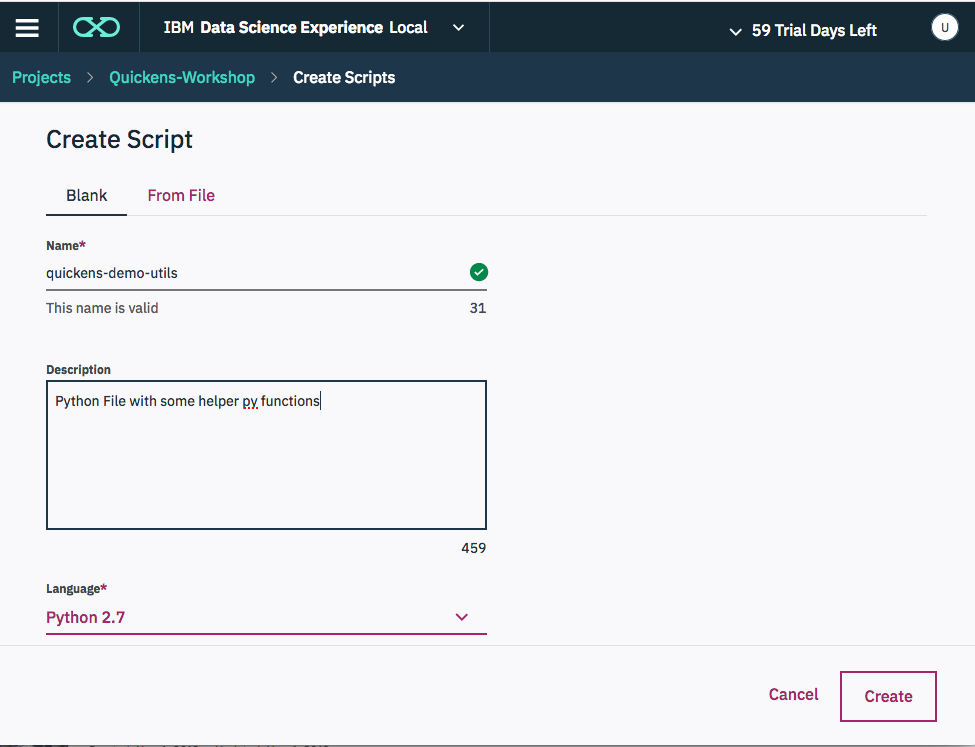
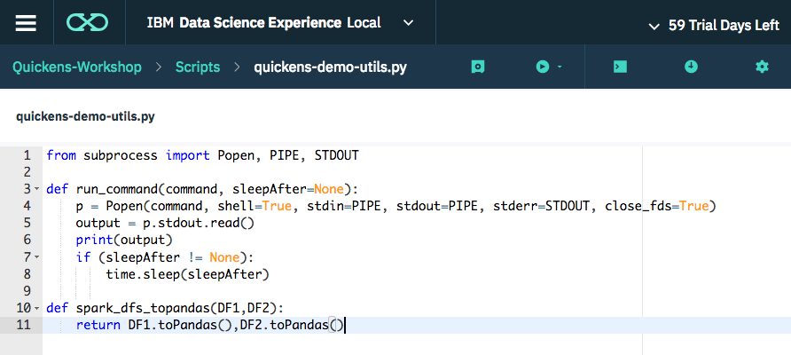


### Part 2 Create "quickens-lab-utils" python package
Once a set of functions are "stable" and ready to package, you can use a Python setup.py file to create a new "quickens_demo_utils" python package (tar.gz or .egg).

**1. Open a terminal from DSX to a python environment within your project**

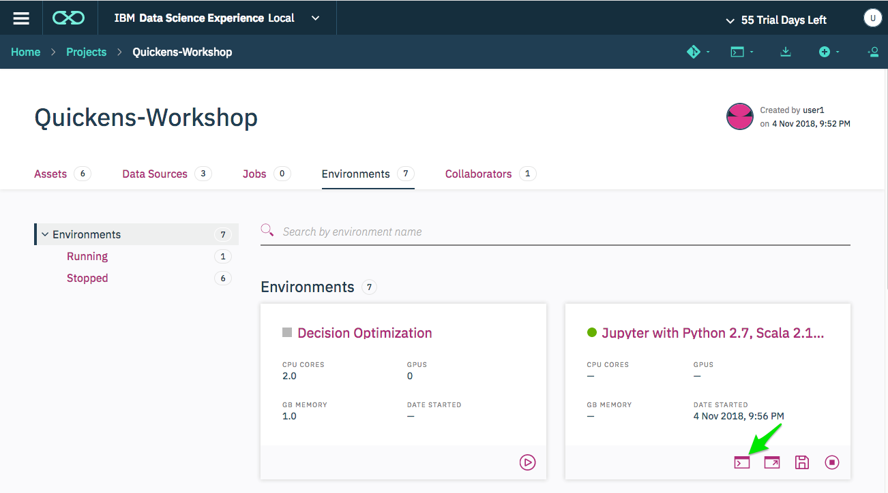


**2. Create the following Directory structure under your project `misc` directory.**

```
$ pwd
/user-home/1001/DSX_Projects/Quickens-Workshop/misc/workshop-packages

.
└── misc
    └── workshop-packages
        ├── quickens_demo_utils
        │   ├── __init__.py
        │   └── qutils.py
        └── setup.py
```

In which **qutils.py** contains the functions:
```
def run_command(command, sleepAfter=None):        
    from subprocess import Popen, PIPE, STDOUT
    p = Popen(command, shell=True, stdin=PIPE, stdout=PIPE, stderr=STDOUT, close_fds=True)
    output = p.stdout.read()
    print(output)
    if (sleepAfter != None):
        time.sleep(sleepAfter)

def spark_dfs_topandas(DF1,DF2):
    return DF1.toPandas(),DF2.toPandas()
```

**setup.py** contains a simple packaging script:
```
from setuptools import setup, find_packages

setup(
    name = "quickens_demo_utils",
    version = "0.1",
    packages=['quickens_demo_utils']    
)
```    

**__init__.py** is an empty file
```
touch __init__.py
```

**3. Create the dist package**

* sdist will create a tar.gz which can be pip installed or used in Livy

```
python setup.py sdist bdist_egg
```

This will create `dist/quickens_demo_utils-0.1.tar.gz` with a package named `quickens_demo_utils`

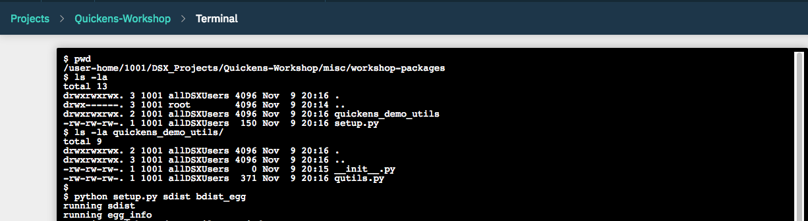


**4. Copy the packaged the tar.gz to Packages directory**


```
$ pwd
/user-home/1001/DSX_Projects/Quickens-Workshop/misc/workshop-packages
$ ls dist/
quickens_demo_utils-0.1-py2.7.egg  quickens_demo_utils-0.1.tar.gz
$ cp dist/*.tar.gz /user-home/1001/DSX_Projects/Quickens-Workshop/packages/python/
```


---

## Part 3 - Using  the packged py in Remote Spark Notebooks

### Method 1 HDFS + sc.addFile

**1. Push the .zip to hdfs**

```
# Show registered WebHDFS Secure URLS which logged in user has access to:
import dsx_core_utils
dsx_core_utils.list_dsxhi_webhdfs_endpoints();
```
In a new cell, upload the zip to the remote HDFS endpoint displayed.
```
dsxlocal_file_location="../packages/python/quickens_demo_utils-0.1.tar.gz"
dsxhi_upload_hdfs_location="/user/user1/quickens_demo_utils-0.1.tar.gz"
webhdfs_endpoint="<your cluster webhdfs output from above"

dsx_core_utils.hdfs_util.upload_file(webhdfs_endpoint, dsxlocal_file_location, dsxhi_upload_hdfs_location )
```

**2. Add the zip to an active Livy session**

```
%%spark

sc.addPyFile("/user/user1/quickens_demo_utils-0.1.tar.gz")
```

**3. Run the custom function**

```
%%spark

from quickens_demo_utils import qutils
```

### Method 2 - Installing "quickens_demo_utils" to a custom image in DSX
1. From the **Environments** Tab within your Project, Launch a terminal for the Environment you want to add a package to
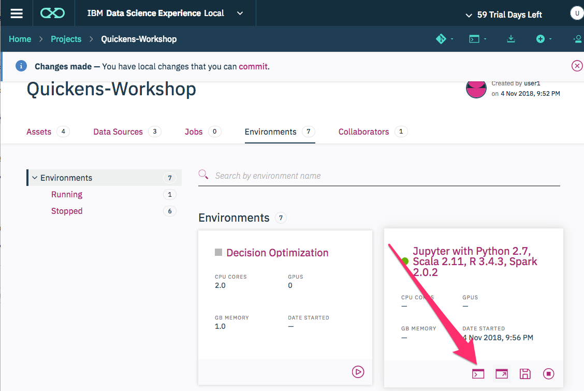

**2. Install the custom package we uploaded**

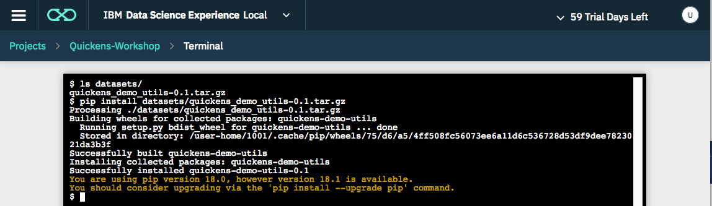

**3. Save the updated image**

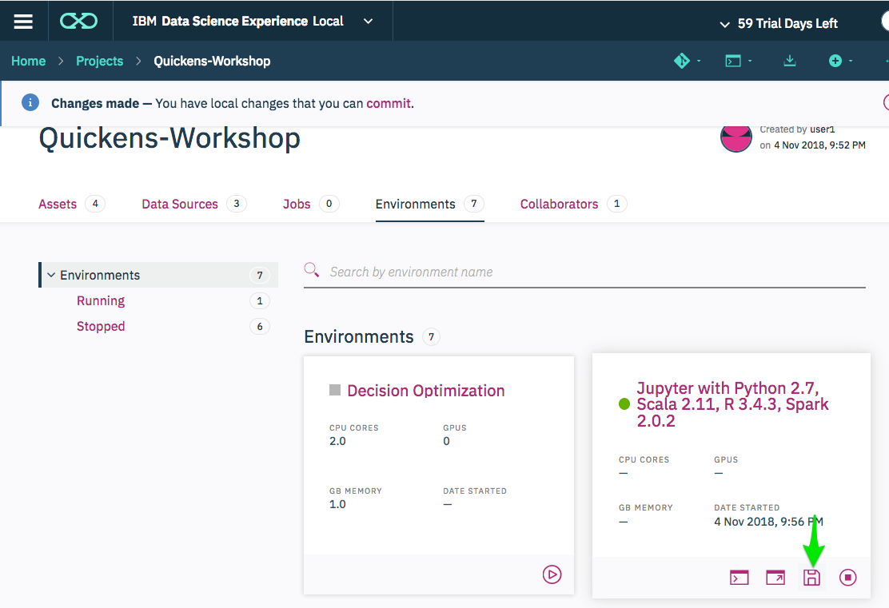

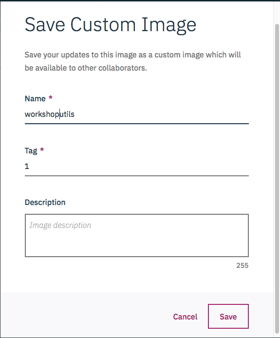

**4. Test the import in DSX Local Environment to verify**
Once installed into an Environment within a Project, the imports are available within the DSX **Local** Environment.
Cells which run with `%%spark` run remotely. Cells without `%%spark` run locally within DSX.

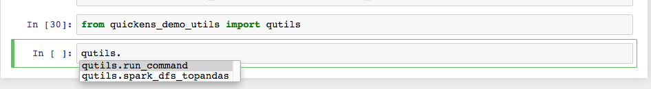


# Lab 2. Pushing an image with Conda installed + User Created packages.

### Part 1 - Create a custom image with `tqdm` from conda channels

The model creation logic for the following sample requires the python `tqdm` library. Since we will be running the model creation logic in a _remote_ livy session, we will need to create a custom image which includes `tqdm`, and then configure our livy session to use that image.  In order to do this you can take the following steps:

#### A. Start an environment
From your project home page, use the `Environments` tab to _start_ a "`Jupyter with Python 2.7, ...`" environment.

#### B. Install `tqdm` into the environment
From your project home page, use the `Environments` tab to _launch a terminal_ shell for the environment that you started in Step A. When you are inside the terminal, type the following command to install `tqdm`:

```
conda install tqdm -y
```

When the command completes, you can `exit` the terminal.

#### C. Save the environment as a custom image
From your project home page, use the `Environments` tab to _save_ the environment that you edited in Step B.


### Part 2 - Push the image to HDP

#### A. As a user, you can Save your image with *Name* and a *Tag*.

Provide the *Name* and *Tag* to the Hadoop Administrator, as only DSX Administrators have the privileges required to Store this image on Hadoop and make it available for all users.

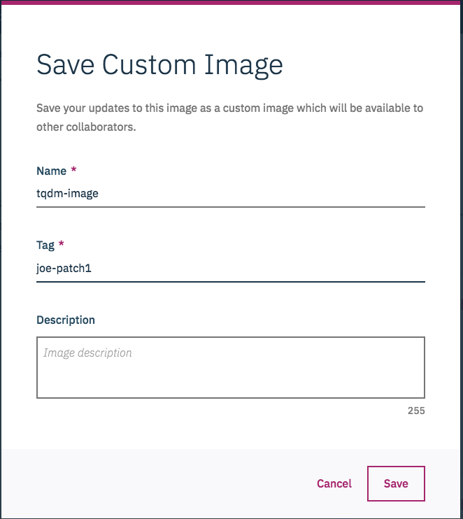


#### B. (Admin only) Push the saved image to hadoop
https://content-dsxlocal.mybluemix.net/docs/content/SSAS34_current/local/hadoopintegration.html#hadoopintegration__push

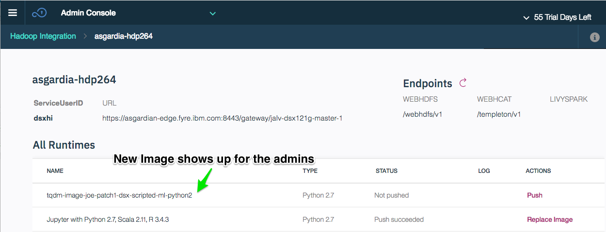


#### C. (User) Can now Run Weather example using tqdm + workshop-utils imports

Open the `Modeling+Weather+Geographies+on+Hadoop+using+Scikit-Learn.ipynb` notebook in this project to proceed with an example which depends on this new custom image.
