# DSX Local Workshop - User built Python packages + Custom Images on Hadoop

In this workshop, we'll cover:
- Creating python functions in Remote Livy Sessions
- Testing .py files via spark addPyFile
- Packaging a set of .py files into a tar/egg
- Installing custom packages into a DSX Runtime Image within a Project
- Saving and tagging an image as a User
- (Admin) Pushing a user-tagged image (Py Virtual Environment) to HDFS, to be available for all DSX users
- (User) View all available Environments available, and run an example Notebook which leverages an environment with additional Conda + User built packages.


This lab is meant to be instructor-led. That is, the instructor will explain the objectives of the DSX capabilities covered in each lab, and demonstrate some of those capabilities at the beginning of each lab.
## Lab 6. Adding/Importing user py files in Remote Spark Notebooks

### Part 1 - Creating and using py functions in remote sessions.

Let's create a Remote Livy Session, which uses the default python environment available from YARN.
We'll use this to define 2 new helper functions.

**1. Create a new Project "Utils-Workshop"**

**2. Create a new Python 2.7 Notebook "Creating and using py functions in Livy Sessions"**

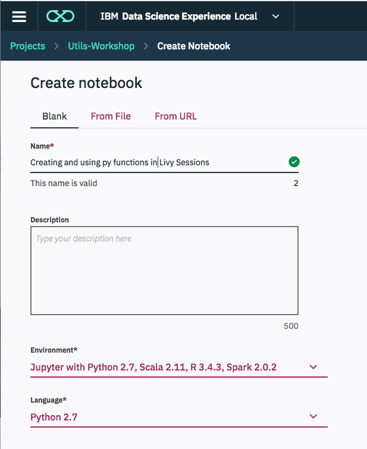

**3. Create a Remote Livy Session**

DSX Includes a set of python helper utils for interacting with remote Hadoop Environments.

First, import `dsx_core_utils` and show a summary of all available DSXHI Endpoints to use within this Notebook.
```
import dsx_core_utils
DSXHI_SYSTEMS = dsx_core_utils.get_dsxhi_info(showSummary=True)
```

Then, define any additional Spark Configurations. See (Livy Sessions REST API)[https://livy.incubator.apache.org/docs/latest/rest-api.html] for additional properties.

Run the following in a cell.
```
myConfig={
 "queue": "default",
 "driverMemory": "2G",
 "numExecutors": 1
}

# Set up sparkmagic to connect to the selected registered HI
# system with the specified configs.
dsx_core_utils.setup_livy_sparkmagic(
  system="<system name shown above>",
  livy="livyspark2",
  addlConfig=myConfig)

# (Re-)load spark magic to apply the new configs.
%reload_ext sparkmagic.magics
```

To see the generated Spark configuration, run `%spark info`.

In a new cell, Start a the remote Livy Session
```
session_name = 'workshop-part1'
livy_endpoint = 'https://value_shown_from_previous_cell/livy2/v1
%spark add -s $session_name -l python -k -u $livy_endpoint
```

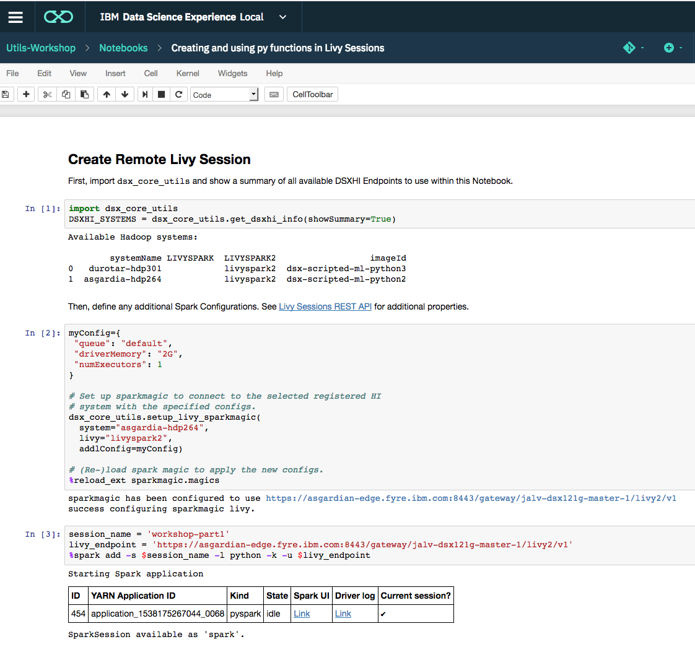

**4. Creating python functions in Remote Livy Sessions**

Lets create 2 simple functions:

- **run_command** - Simple wrapper to subprocess, to run a linux command within the Driver YARN Container

- **spark_dfs_topandas** - Sample function that takes 2 Spark DFs and returns 2 Pandas DFs. ToPandas() is generally not advisable, as it will be resource intensive on the Spark Driver. Some ML Tools however, require the DataFrame to be a Pandas DF, so this is merelly an example for such scenarios.

```
%%spark -s $session_name
from subprocess import Popen, PIPE, STDOUT

def run_command(command, sleepAfter=None):        
    p = Popen(command, shell=True, stdin=PIPE, stdout=PIPE, stderr=STDOUT, close_fds=True)
    output = p.stdout.read()
    print(output)
    if (sleepAfter != None):
        time.sleep(sleepAfter)

def spark_dfs_topandas(DF1,DF2):
    return DF1.toPandas(),DF2.toPandas()
```

Test run_command, which should return a NodeManager hostname where your Spark Driver is running
```
%%spark -s $session_name

run_command("hostname -f")
run_command("pwd")
```

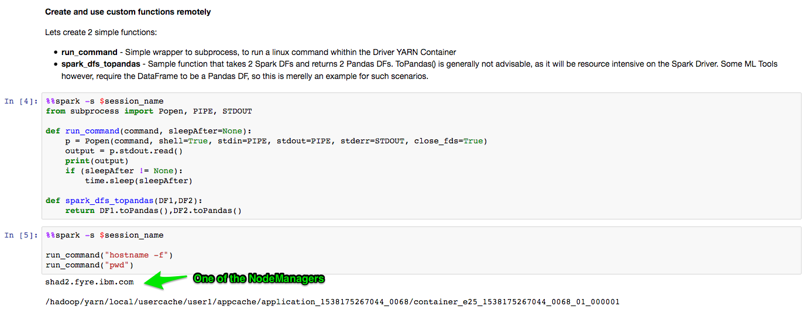

Proceed to Part 2 in a new browser tab.


### Part 2. Testing .py files via spark addPyFile

**1. Save the functions as a new Script in the DSX Project**

Navigate to the `Utils-Workshop` project. Select `Scripts` on the Left Hand Side, and "Add Script"

Create a new script named `quicken-demo-utils`

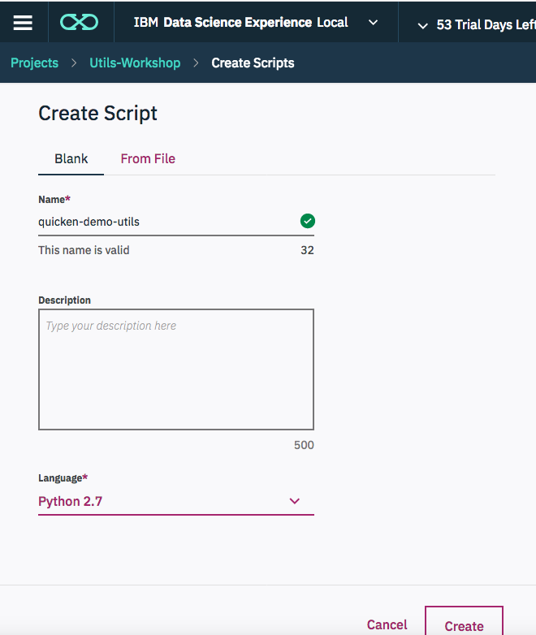

With the contents:

```
def run_command(command, sleepAfter=None):   
    from subprocess import Popen, PIPE, STDOUT
    p = Popen(command, shell=True, stdin=PIPE, stdout=PIPE, stderr=STDOUT, close_fds=True)
    output = p.stdout.read()
    print(output)
    if (sleepAfter != None):
        time.sleep(sleepAfter)

def spark_dfs_topandas(DF1,DF2):
    return DF1.toPandas(),DF2.toPandas()
```

- Click on the Save Icon

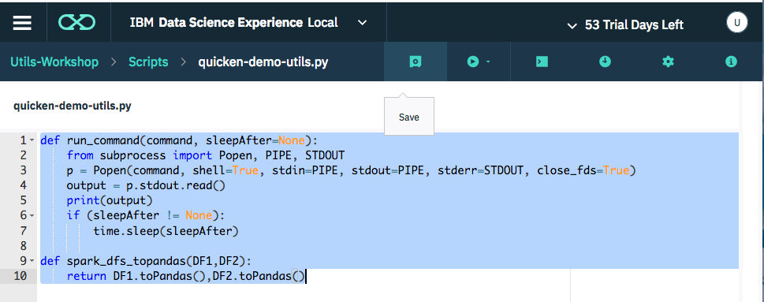

**2. Navigate back to the `Utils-Workshop` Project**

Re-open the "Creating and using py functions in Livy Sessions" Notebook Tab.

**3. Upload `quicken-demo-utils.py` script which was saved above, to your HDFS user directory.**

- Use cell magic `!ls` to see the relative path of the script which was just saved:

- In a new cell, Show registered WebHDFS Secure URLS which logged in user has access to:
```
import dsx_core_utils
dsx_core_utils.list_dsxhi_webhdfs_endpoints();
```

- Use `dsx_core_utils.hdfs_util.upload_file` to upload a file from DSX to your HDFS desired path
```
dsxlocal_file_location="../scripts/quicken_demo_utils.py"
dsxhi_upload_hdfs_location="/user/user1/quicken_demo_utils.py"
webhdfs_endpoint="your cluster webhdfs output from above"

dsx_core_utils.hdfs_util.upload_file(webhdfs_endpoint, dsxlocal_file_location, dsxhi_upload_hdfs_location )
```

**Example:**

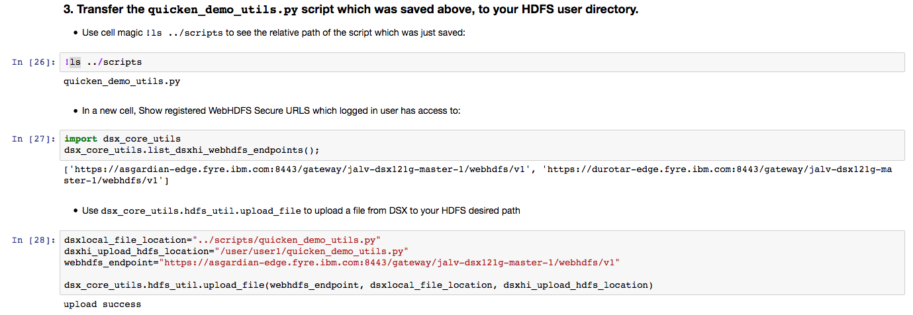


**4. Test the .py file via sc.addPyFile in a new Livy Session¶**

- Delete the old session with %spark cleanup
- Create a new session with %spark add
```
%spark cleanup


%spark add -s $session_name -l python -k -u $livy_endpoint
```

- Test the imported Utils
```
%%spark
sc.addPyFile("hdfs:///user/user1/quicken_demo_utils.py")
```

```
%%spark
import quicken_demo_utils as utils
```

```
%%spark -s $session_name
utils.run_command("hostname -f")
utils.run_command("pwd")
```

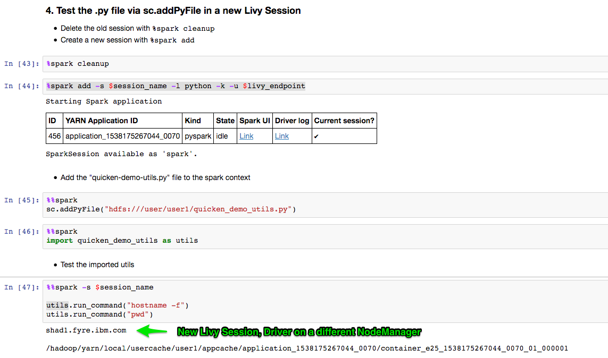


### Part 3 Create "quicken-lab-utils" python package

Once a set of functions are "stable" and ready to package, you can use a Python setup.py file to create a new "quicken_demo_utils" python package (tar.gz or .egg).

**1. Navigate back to the Projects Page > Utils-Workshop**

**2. In the Environments tab, Open a terminal to one of the Envs**

- For the "Jupyter with Python 2.7..." Environment, Open a new Terminal

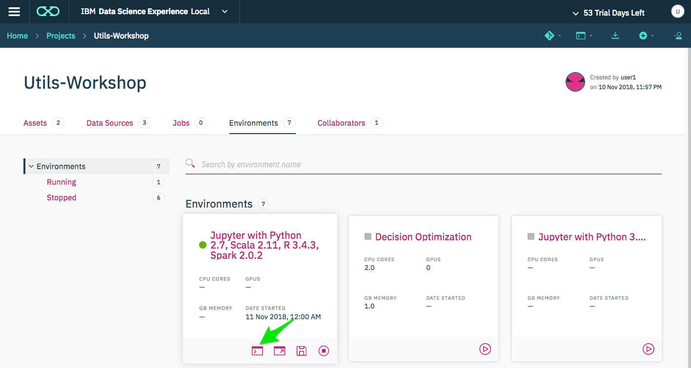


**3. Create the following Directory structure under your project `misc` directory.**

```
$ pwd
/user-home/1001/DSX_Projects/Utils-Workshop/misc/workshop-packages

.
└── misc
    └── workshop-packages
        ├── quicken_demo_utils
        │   ├── __init__.py
        │   └── qutils.py
        └── setup.py
```

By running:
```
mkdir misc/workshop-pacakges
vi misc/workshop-pacakges/setup.py

mkdir misc/workshop-pacakges/quicken_demo_utils
touch misc/workshop-pacakges/quicken_demo_utils/__init__.py
vi misc/workshop-pacakges/quicken_demo_utils/qutils.py
```

In which **setup.py** contains a simple packaging script:
```
from setuptools import setup, find_packages

setup(
    name = "quicken_demo_utils",
    version = "0.1",
    packages=['quicken_demo_utils']    
)
```    

**qutils.py** contains the functions:
```
def run_command(command, sleepAfter=None):        
    from subprocess import Popen, PIPE, STDOUT
    import time
    p = Popen(command, shell=True, stdin=PIPE, stdout=PIPE, stderr=STDOUT, close_fds=True)
    output = p.stdout.read()
    print(output)
    if (sleepAfter != None):
        time.sleep(sleepAfter)

def spark_dfs_topandas(DF1,DF2):
    return DF1.toPandas(),DF2.toPandas()
```

**__init__.py** is an empty file
```
touch __init__.py
```

**4. Create the dist package**

* sdist will create a tar.gz which can be pip installed or used in Livy

```
cd misc/workshop-pacakges
python setup.py sdist bdist_egg
```

This will create `dist/quicken_demo_utils-0.1.tar.gz` with a package named `quicken_demo_utils`

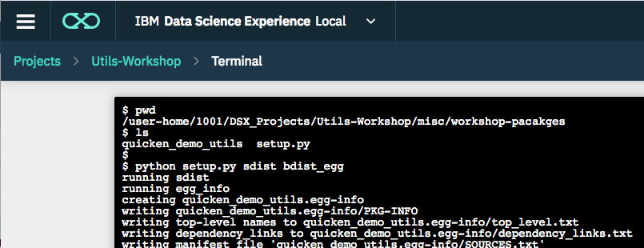


**5. Copy the packaged the tar.gz to Packages directory**


```
$ pwd
/user-home/1001/DSX_Projects/Utils-Workshop/misc/workshop-pacakges

$ ls dist/
quicken_demo_utils-0.1-py2.7.egg  quicken_demo_utils-0.1.tar.gz

$ cp dist/*.tar.gz /user-home/1001/DSX_Projects/Utils-Workshop/packages/python/
```

---

## Lab 7. Image Creation and Pushdown

### Part 1 - Installing "quicken_demo_utils" to a custom image in DSX

**1. From the 'Environments' Tab within your Project, Launch a terminal for the Environment you want to add a package to**

- For the "Jupyter with Python 2.7..." Environment, Open a new Terminal


**2. Install the custom package we uploaded**
- Users can install packages to their Environments, as environments are controlled at **Project** level.
```
$  ls packages/python/
quicken_demo_utils-0.1.tar.gz

$ pip install packages/python/quicken_demo_utils-0.1.tar.gz
Processing ./packages/python/quicken_demo_utils-0.1.tar.gz
Building wheels for collected packages: quicken-demo-utils
  Running setup.py bdist_wheel for quicken-demo-utils ... done
  Stored in directory: /user-home/1001/.cache/pip/wheels/aa/77/b2/b7d1cca665af2366db966d0ee9aa71ce22adf4f71b2e32076e
Successfully built quicken-demo-utils
Installing collected packages: quicken-demo-utils
Successfully installed quicken-demo-utils-0.1
```

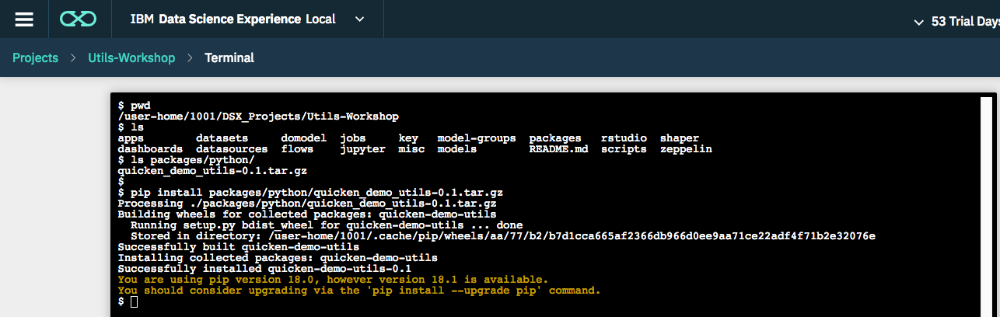

- Install an additional package available from `conda`, into this custom image
```
conda install tqdm -y

```

**3. Save the updated image**

- Users can save and tag an environment.

```
name:  demo-utils-tqdm
tag: v0.0.1
```

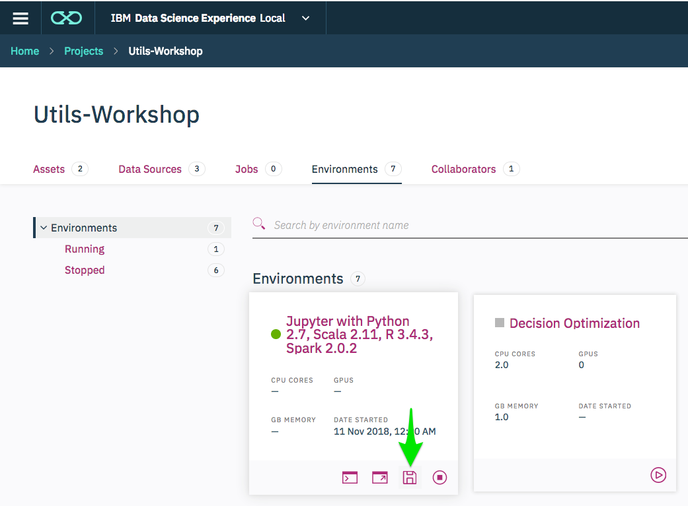

- Create some relevant tags. This allows the Admins to be able to see the User-created Environments, and when ready "Push" them to HDFS for all users to be able to leverage.

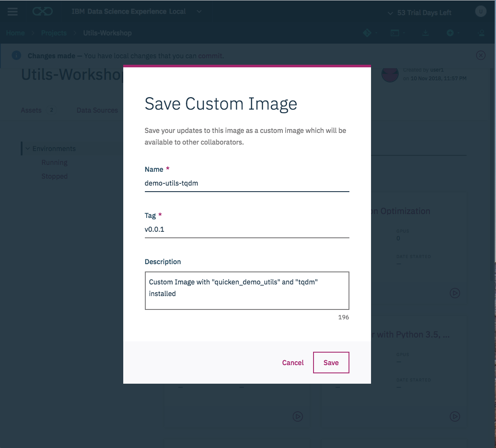


**4. Test the import in DSX Local Environment to verify**

Once installed into an Environment within a Project, the imports are available within the DSX **Local** Environment. Any Notebooks within **the user**'s the project which use the same Jupyter 2.7 Runtime, will have quicken_demo_utils installed.
Cells which run with `%%spark` run remotely. Cells without `%%spark` run locally within DSX.
```
# Import the quicken_demo_utils helper method
from quicken_demo_utils import qutils

# should return a jupyter pod name, as it is running within DSX
qutils.run_command("hostname -f")
```

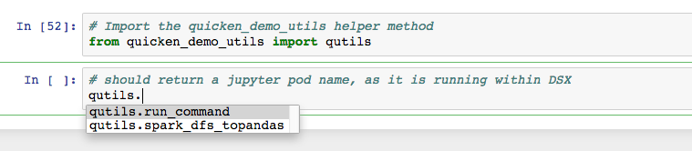


### Part 2 Pushing and Using Images on Hadoop

Once a user has created and tagged an image, the admin can use that Name and Tag to make the python virtual environment available on HDFS for all Livy Sessions (All users, read only access HDFS).


**(Admin only) Push a saved image to hadoop**
https://content-dsxlocal.mybluemix.net/docs/content/SSAS34_current/local/hadoopintegration.html#hadoopintegration__push
```
# User provides details for a saved image
- image name: demo-utils-tqdm
- image tag: v0.0.1
- Base Environment: dsx-scripted-ml-python2

# Runtime name displayed under Hadoop Integration:
demo-utils-tqdm-v0.0.1-dsx-scripted-ml-python2
```

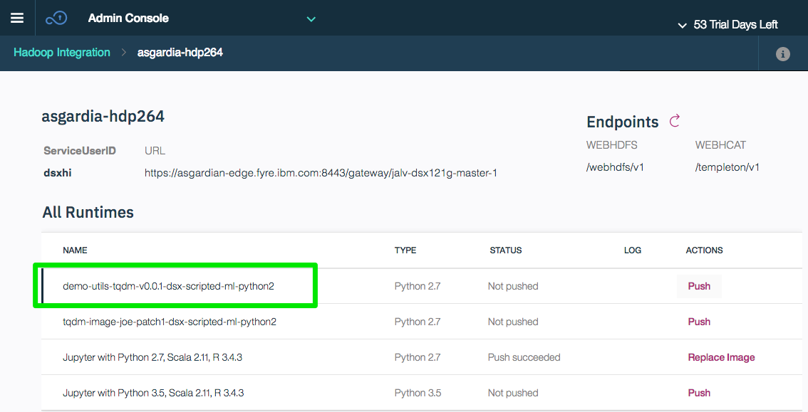

- Images have Read Only access on HDFS, and only the admins can update the globally available list.


**1. (Users) Use custom images in Livy Sessions**

Once an image has been "Pushed", all DSX users will see the image details with the `dsx_core_utils` helper methods.

- Display DSXHI Endpoints and Images
```
import dsx_core_utils
DSXHI_SYSTEMS = dsx_core_utils.get_dsxhi_info(showSummary=True)
```

**Note** There is a new "imageId" displayed
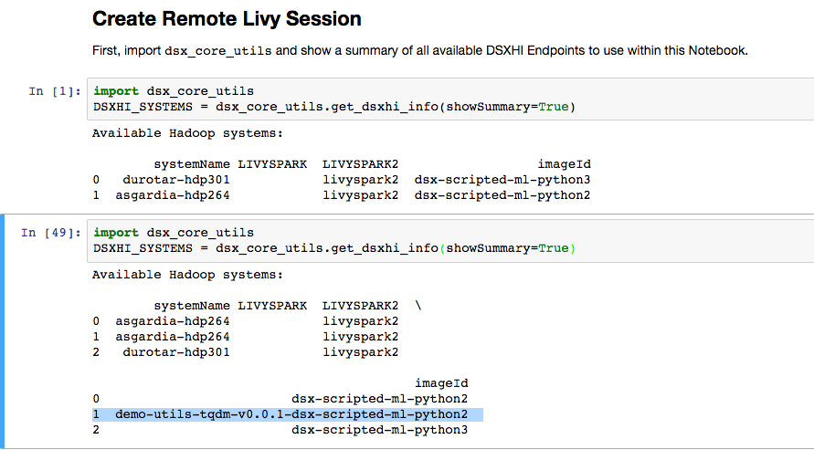


- Spark Config which Leverages the custom image:
```
myConfig={
 "queue": "default",
 "driverMemory": "2G",
 "numExecutors": 1
}

# Set up sparkmagic to connect to the selected registered HI
# system with the specified configs.
dsx_core_utils.setup_livy_sparkmagic(
  system="<system name shown above>",
  livy="livyspark2",
  imageId="demo-utils-tqdm-v0.0.1-dsx-scripted-ml-python2",
  addlConfig=myConfig)

# (Re-)load spark magic to apply the new configs.
%reload_ext sparkmagic.magics
```

**2. Proceed with Example Notebook**

Open the `Modeling+Weather+Geographies+on+Hadoop+with+Scikit.ipynb` notebook in this project to proceed with an example which depends on this new custom image.
